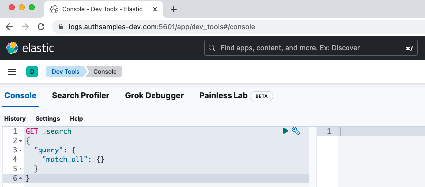

# Elasticsearch Log Aggregation

Resources for demo level deployments of the Elastic Stack, to be used for API log aggregation.\
This is part of an overall [Effective API Logging](https://authguidance.com/effective-api-logging/) design.

## Docker Commands

First ensure that a Docker engine is installed.

### Configure DNS and SSL

Configure DNS by adding the logs domain name to your hosts file:

```text
127.0.0.1 localhost logs.authsamples-dev.com
```

Download SSL development certificates:

```bash
./deployment/docker-local/downloadcerts.sh
```

Next configure [Browser SSL Trust](https://authguidance.com/2017/11/11/developer-ssl-setup#browser) for the SSL root certificate:

```text
./deployment/docker-local/certs/authsamples-dev.ca.pem
```

### Deploy the System

Run the following command to deploy Docker components for Elasticsearch, Kibana and Filebeat:

```bash
./deployment/docker-local/deploy.sh
```

The script will wait for completion and open Kibana in the system browser.\
Login with a username of `elastic` and a password of `Password1`, then query API logs:



## Further Information

- See the [Elasticsearch Log Aggregation Setup](https://authguidance.com/log-aggregation-setup/) for details on how to run APIs and test clients
- See [API Platform Technical Support Analysis](https://authguidance.com/api-technical-support-analysis/) for some example queries on API logs
